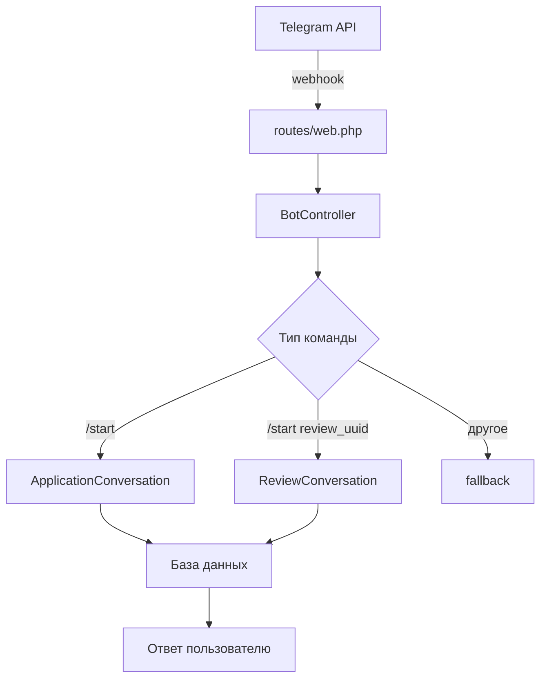

# Документация Telegram бота медицинского центра

## Общее описание

Это Telegram бот для записи к врачам в медицинский центр, построенный на Laravel с использованием BotMan framework. Бот позволяет:
- Записываться на прием к врачам
- Просматривать информацию о врачах и клиниках
- Оставлять отзывы о врачах
- Использовать промокоды при записи

## Архитектура проекта

### Основные компоненты

```
app/Bot/                          # Логика Telegram бота
├── Conversations/                # Диалоги бота
│   ├── ApplicationConversation.php  # Запись на прием
│   └── ReviewConversation.php      # Оставление отзывов

app/Http/Controllers/Bot/         # HTTP контроллеры
└── BotController.php             # Основной контроллер бота

routes/web.php                   # Маршруты webhook
config/botman.php                 # Конфигурация BotMan
storage/botman/                   # Файловое хранилище состояний
```

### Схема работы



## Основные файлы и их функции

### 1. BotController.php
**Назначение**: Главная точка входа для всех webhook-запросов от Telegram

**Основные функции**:
- Инициализация BotMan framework
- Настройка файлового хранилища для состояний диалогов
- Регистрация обработчиков команд (`/start`, fallback)
- Обработка ошибок

**Ключевые методы**:
- `handle()` - обрабатывает входящие webhook-запросы
- `setupBotHandlers()` - настраивает команды бота

### 2. ApplicationConversation.php  
**Назначение**: Основной диалог для записи на прием к врачу

**Логика работы**:
1. Показывает главное меню с вариантами действий
2. Собирает данные пациента пошагово
3. Позволяет выбрать город, клинику, врача
4. Запрашивает контактные данные
5. Создает заявку в базе данных

**Основные методы**:
- `showMainMenu()` - главное меню бота
- `askCity()` - выбор города 
- `showDoctors()` - список врачей
- `showDoctorInfo()` - информация о враче
- `askPhone()`, `askFullName()` - сбор данных пациента
- `createApplication()` - создание заявки

### 3. ReviewConversation.php
**Назначение**: Диалог для оставления отзывов о врачах

**Логика работы**:
1. Проверяет существование врача по UUID
2. Показывает информацию о враче
3. Запрашивает оценку (1-5 звезд)
4. Запрашивает текст отзыва (опционально)
5. Сохраняет отзыв и обновляет рейтинг врача

**Основные методы**:
- `showDoctorAndAskRating()` - выбор оценки
- `askReviewText()` - ввод текста отзыва
- `confirmReview()` - подтверждение отзыва
- `saveReview()` - сохранение в базу данных

## Пользовательские сценарии

### 1. Запись на прием (основной сценарий)

```
Пользователь -> /start
Бот -> Главное меню [Записаться на прием | Просмотр врачей | Запись с промокодом]
Пользователь -> "Записаться на прием"
Бот -> Запрос даты рождения (опционально)
Бот -> Выбор города
Бот -> Выбор [Врачи | Клиники]
Бот -> Список врачей/клиник
Бот -> Информация о враче
Пользователь -> "Записаться"
Бот -> Запрос телефона
Бот -> Запрос ФИО пациента
Бот -> Запрос ФИО родителя (опционально)
Бот -> Согласие на обработку данных
Бот -> Создание заявки
Бот -> Подтверждение с номером заявки
```

### 2. Оставление отзыва (deep link)

```
Пользователь -> /start review_doctor_uuid
Бот -> Информация о враче
Бот -> Запрос оценки (1-5 звезд)
Бот -> Запрос текста отзыва (опционально)
Бот -> Подтверждение отзыва
Бот -> Сохранение отзыва
Бот -> Благодарность за отзыв
```

### 3. Просмотр врачей

```
Пользователь -> "Просмотр врачей"
Бот -> Выбор города
Бот -> Список врачей в городе
Бот -> Информация о выбранном враче
Бот -> [Записаться | Оставить отзыв | Отзывы]
```

## Хранилище данных

### Файловое хранилище BotMan
Расположение: `storage/botman/`

**Назначение**: Сохранение состояний диалогов пользователей между сообщениями

**Структура**:
- `cache/` - временный кеш BotMan
- `conversation-*.json` - состояния активных диалогов
- `user_Telegram_*.json` - данные пользователей

### База данных
Основные таблицы для бота:
- `applications` - заявки на прием
- `cities` - города 
- `clinics` - клиники
- `doctors` - врачи
- `reviews` - отзывы о врачах

## Конфигурация

### Переменные окружения (.env)
```env
TELEGRAM_TOKEN=your_bot_token_here  # Токен бота от @BotFather
```

### Конфигурация BotMan (config/botman.php)
```php
'drivers' => [
    'telegram' => [
        'token' => env('TELEGRAM_TOKEN'),
    ],
],
```

### Webhook маршрут (routes/web.php)
```php
Route::match(['get', 'post'], '/botman', [BotController::class, 'handle']);
```

## Команды для управления ботом

### Установка webhook
```bash
php artisan telegram:webhook https://yourdomain.com/botman
```

### Проверка статуса бота
```bash
php artisan telegram:info
```

### Автонастройка для тестирования
```bash
php artisan bot:start-testing
```

## Безопасность

### CSRF защита
Webhook маршрут `/botman` исключен из CSRF проверки в `VerifyCsrfToken` middleware.

### Валидация данных
- Проверка формата телефона и даты рождения
- Ограничение длины текста отзыва (4000 символов)
- Проверка существования врача по UUID

### Обработка ошибок
- Все ошибки логируются через Laravel Log
- Webhook всегда возвращает 200 OK для предотвращения повторных запросов Telegram

## Особенности реализации

### Deep Links
Формат: `https://t.me/your_bot?start=review_doctor_uuid`
- Позволяет перейти сразу к оставлению отзыва о конкретном враче
- UUID врача извлекается из параметра команды `/start`

### Состояния диалога
- Используется файловое хранилище BotMan
- Каждый пользователь может иметь только один активный диалог
- Состояние автоматически очищается после завершения диалога

### Кнопки навигации
- "В меню" - возврат к главному меню (доступно почти везде)
- "Назад" - возврат к предыдущему шагу
- "Пропустить" - для опциональных полей

### Промокоды
- Сохраняются в поле `promo_code` заявки
- Валидация и применение скидок не реализованы в боте (обрабатывается в 1C)

## Логирование и отладка

### Логи Laravel
Все ошибки бота записываются в стандартные логи Laravel:
```
storage/logs/laravel.log
```

### Отладка webhook
Для локальной разработки используйте ngrok:
```bash
ngrok http 8000
php artisan telegram:webhook https://your-ngrok-url.ngrok.io/botman
```

### Тестирование диалогов
1. Запустите команду `php artisan bot:start-testing`
2. Откройте бота в Telegram
3. Отправьте `/start` для начала диалога
4. Проверьте логи на наличие ошибок

## Возможные улучшения

### Краткосрочные
- Добавить валидацию промокодов
- Реализовать отправку уведомлений через webhook
- Добавить возможность отмены заявки

### Долгосрочные  
- Интеграция с календарем врачей
- Напоминания о приеме
- Многоязычная поддержка
- Оплата через бота

## Troubleshooting

### Бот не отвечает
1. Проверьте токен в .env файле
2. Проверьте настройку webhook: `php artisan telegram:info`
3. Проверьте логи на ошибки: `tail -f storage/logs/laravel.log`

### Диалог "зависает"
1. Очистите состояния: удалите файлы из `storage/botman/`
2. Перезапустите диалог командой `/start`

### Ошибки базы данных
1. Проверьте подключение к БД
2. Выполните миграции: `php artisan migrate`
3. Заполните тестовые данные: `php artisan db:seed`
